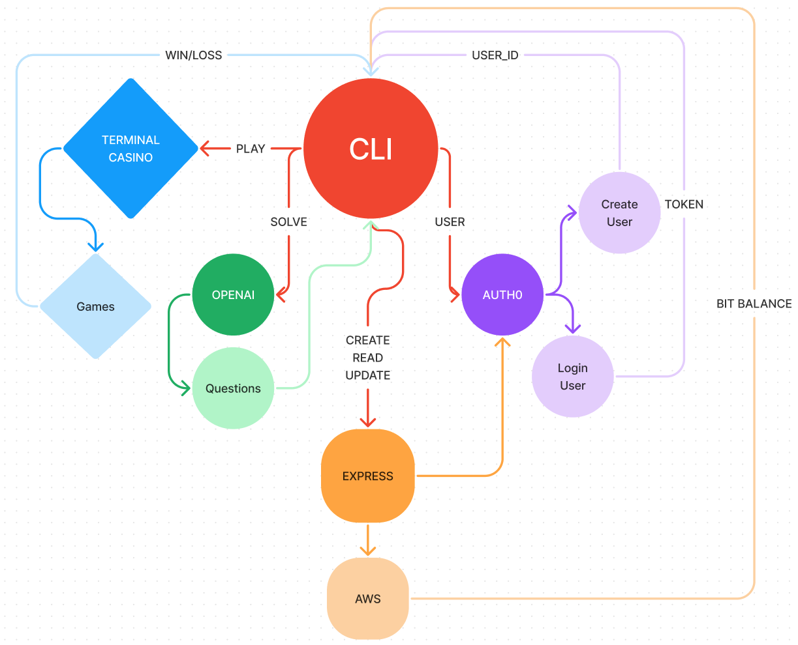

# Terminal Casino CLI

A solo player text based casino app that encourages the user to have healthier gambling
habits. The user will earn `bits` by solving math equations and use those `bits`
to play casino games.

## Getting Started

### Requirements

For development, you will only need [Node](http://nodejs.org/) installed in your
environment.
Please use the appropriate [Editorconfig](http://editorconfig.org/) plugin for your
Editor (not mandatory).

### Install

    git clone https://github.com/T-Casino-Inc/t-casino-cli.git
    cd t-casino-cli
    npm install

### Configure app

Create `.env` file in the root directory and add the following:

```env
CLIENT_ID=YOUR_CLIENT
CLIENT_SECRET=YOUR_SECRET
OPEN_API_KEY=YOUR_KEY
EXPRESS_URL=https://terminal-casino-backend.onrender.com
```

### Start

    npm run dev
    npm start

## Architecture



### Languages & tools

- JavaScript
- Node.js
- Inquirer.js
- Axios
- Dotenv
- Openai

## Change Log

1.0.0 - Initial release

## Collaborators

- Justin Cheeseman
- Isai Chaidez
- Brock Britton
